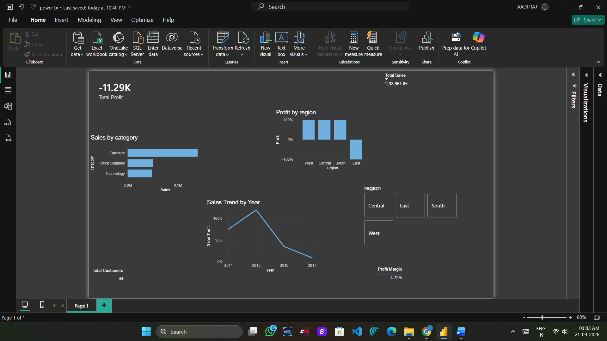

# 📊 Task 2: Data Analytics & Business Intelligence Project

## 📌 Project Overview

This project focuses on analyzing business performance using real-world data.
The goal is to extract insights, identify key issues, and provide actionable recommendations using SQL, Excel, and Power BI.

---

## 🎯 Objectives

* Analyze sales, profit, and customer data
* Identify loss-making regions and categories
* Track sales trends over time
* Provide data-driven business recommendations

---

## 🛠 Tools & Technologies

* **SQL (MySQL)** → Data extraction & analysis
* **Excel** → Data cleaning & pivot analysis
* **Power BI** → Interactive dashboard creation

---

## 📂 Project Structure

```bash
task2-data-analytics/
│
├── task2_analysis.sql        # SQL queries
├── task2_excel_analysis.xlsx # Excel analysis
├── powerbi_dashboard.pbix    # Power BI dashboard
├── task_2.csv                # Dataset
├── business_report.docx      # Business report
├── dashboard.jpeg            # Dashboard screenshot
```

---

## 📊 Key Insights

### 🔻 Profitability Issue

* Overall **profit margin is -4.72%**
* Business is operating at a loss despite strong sales

### 🌍 Regional Performance

* **East region is loss-making**
* Other regions (West, Central, South) are profitable

### 🛒 Category Analysis

* **Furniture has highest sales**
* Profit may be affected due to high discounts or costs

### 📈 Sales Trend

* Sales peaked in **2015**
* Significant decline observed after 2015

### 👥 Customer Insights

* Only **44 unique customers**
* Indicates limited customer base

---

## 📸 Dashboard Preview



---

## 💡 Recommendations

* Improve performance in **East region**
* Optimize discount strategy to increase profit
* Focus on customer acquisition & retention
* Re-evaluate pricing in high-sales categories

---

## 📄 Business Report

Detailed analysis is available in:
👉 `business_report.docx`

---

## 🚀 Conclusion

The analysis reveals that while the business has strong sales potential, it suffers from profitability issues.
By addressing regional inefficiencies and optimizing pricing strategies, the business can achieve sustainable growth.

---

## 🙌 Author

**Aadi Raj**
Data Analytics Intern

---

⭐ If you found this project useful, consider giving it a star!
